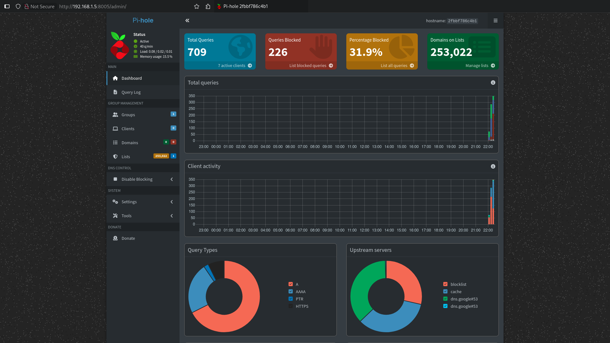
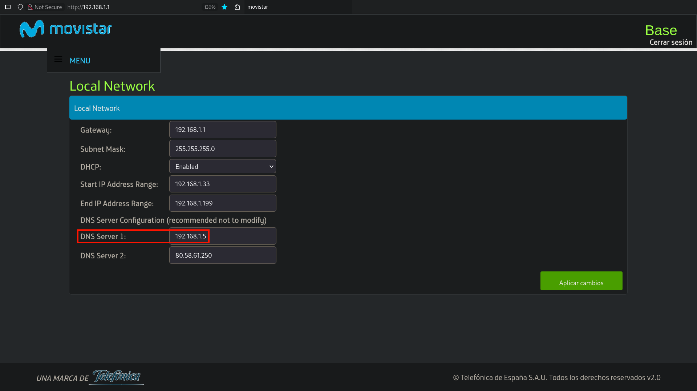

# Docker Pi-hole (Personal Fork)

<div align="center">
  <a href="https://pi-hole.net/">
    
  </a>
  <br>
  <strong>Network-wide ad blocking via your own Linux hardware</strong>
  <br>
  <br>
  <div align="center">
    <a href="https://pi-hole.net/">Pi-hole website</a> |
    <a href="https://docs.pi-hole.net/">Documentation</a> |
    <a href="https://discourse.pi-hole.net/">Discourse Forum</a> |
    <a href="https://pi-hole.net/donate">Donate</a>
  </div>
  <br>
  <br>
</div>

## Why this fork?

This repository is a personal minimal fork designed to keep things as simple as possible for running Pi-hole as a local DNS blocker.

## Requirements

You need a computer with a static IP that will act as the DNS server for your network. The machine requires:

- docker
- docker-compose

## Configuration

Clone the repository:

```bash
git clone https://github.com/pumukydev/docker-pi-hole.git
cd docker-pi-hole
```

Edit the `docker-compose.yml` file and set your own admin password (used for the web interface):

```docker-compose.yml
...
FTLCONF_webserver_api_password: 'changeme'
...
```

Then start the container.

```bash
docker compose up -d --build
```

Access the web interface at http://YOUR-HOST-IP:8005/admin

Here you can configure and monitor your Pi-hole installation.



Finally, make sure to set your device's IP as the **primary DNS server** in your router's network settings.



That's it! Now your entire network will be filtered and ads will be blocked automatically.